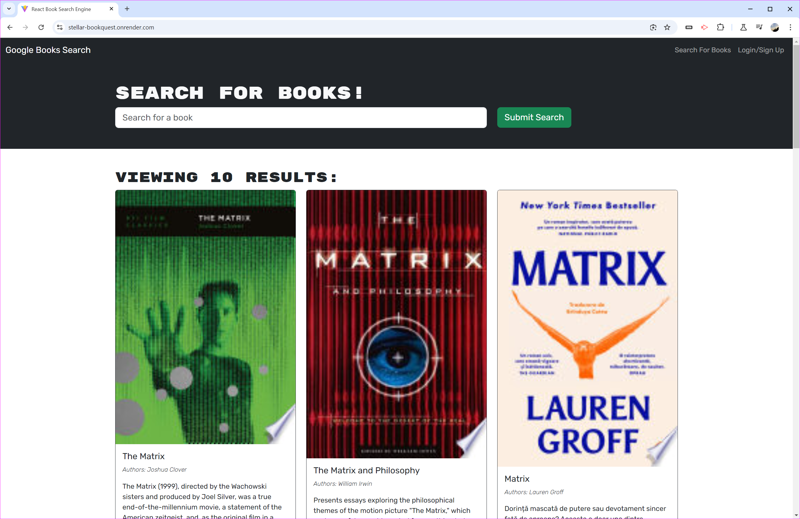

# Stellar-Bookquest

## Description

Stellar-Bookquest is a full-stack MERN application that allows avid readers to search for new books to read and keep a list of books to purchase. It uses the Google Books API to search for books and allows users to save books to their account. The application was built using React for the front end, MongoDB for the database, and Node.js/Express.js for the server, with GraphQL and Apollo Server for efficient data fetching and manipulation.

## Table of Contents

- [Screenshot](#screenshot)
- [Usage](#usage)
- [Features](#features)
- [Technologies Used](#technologies-used)
- [Deployment](#deployment)
- [Contributing](#contributing)
- [License](#license)
- [Questions](#questions)
- [Citations](#citations)

## Screenshot

## Usage

1. Visit the deployed application URL.
2. Sign up for an account or log in if you already have one.
3. Use the search bar to find books by title, author, or keywords.
4. Click on a book to view more details.
5. Save books to your account by clicking the "Save" button.
6. View your saved books by navigating to the "Saved Books" page.
7. Remove books from your saved list as needed.

## Features

- User authentication (signup, login, logout)
- Book search using Google Books API
- Save books to user account
- View saved books
- Remove books from saved list
- Responsive design for various screen sizes

## Technologies Used

- MongoDB
- Express.js
- React
- Node.js
- GraphQL
- Apollo Server/Client
- JWT for authentication
- Vite for fast development and building
- React Bootstrap for styling
- Render for deployment

## Deployment

The application is deployed on Render. You can visit the live site at [Stellar-Bookquest](https://stellar-bookquest.onrender.com/).

To deploy your own version:

1. Fork and clone the repository
2. Set up a MongoDB Atlas account and create a cluster
3. Create a Render account
4. Connect your GitHub repository to Render
5. Set up the necessary environment variables in Render (MONGODB_URI, JWT_SECRET)
6. Deploy the application

## Contributing

Contributions to this project are not currently accepted. This is a graded classroom assignment, and it is an assessment of the developer's skills.

## License

This project is licensed under the MIT License.

## Questions

If you have any questions about the CodeCanvas, you can reach me at Jake_Toton@live.com. You can find more of my work at [Jtoton](https://github.com/Jtoton).

## Citations

- This project was created as part of the University of Utah's Full Stack Web Development Bootcamp.
- The Google Books API was used for book data.
- React Bootstrap was used for styling components.
- The MERN stack architecture was inspired by course materials and best practices in web development.
- MongoDB Documentation. (n.d.). MongoDB Manual. Retrieved from https://docs.mongodb.com/manual/
- Express.js Documentation. (n.d.). Express - Node.js web application framework. Retrieved from https://expressjs.com/
- React Documentation. (n.d.). React – A JavaScript library for building user interfaces. Retrieved from https://reactjs.org/docs/getting-started.html
- Node.js Documentation. (n.d.). Node.js v14.x documentation. Retrieved from https://nodejs.org/docs/latest-v14.x/api/
- GraphQL Documentation. (n.d.). GraphQL: A query language for your API. Retrieved from https://graphql.org/learn/
- Apollo Documentation. (n.d.). Introduction to Apollo Server. Retrieved from https://www.apollographql.com/docs/apollo-server/
- Apollo Client Documentation. (n.d.). Introduction to Apollo Client. Retrieved from https://www.apollographql.com/docs/react/
- JSON Web Tokens. (n.d.). Introduction to JSON Web Tokens. Retrieved from https://jwt.io/introduction/
- Vite Documentation. (n.d.). Vite - Next Generation Frontend Tooling. Retrieved from https://vitejs.dev/guide/
- React Bootstrap Documentation. (n.d.). React Bootstrap - The most popular front-end framework, rebuilt for React. Retrieved from https://react-bootstrap.github.io/
- ChatGPT. (n.d.). https://chatgpt.com/ - Used to assist with error/defect locations, via console logs and interpritation of console outputs.
- Render Documentation. (n.d.). Render Docs - Deploy your apps quickly and easily. Retrieved from https://render.com/docs
- Google Books APIs Documentation. (n.d.). Google Books APIs. Retrieved from https://developers.google.com/books
- React Router Documentation. (n.d.). React Router: Declarative Routing for React.js. Retrieved from https://reactrouter.com/web/guides/quick-start
- Mongoose Documentation. (n.d.). Mongoose ODM v5.13.7. Retrieved from https://mongoosejs.com/docs/guide.html
